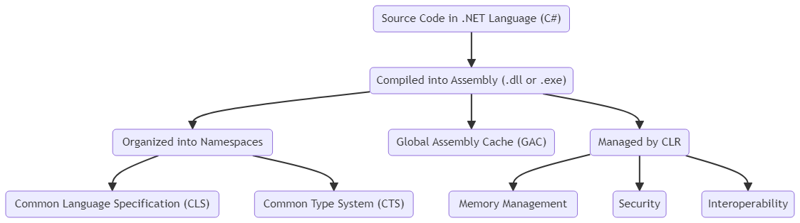

## Assembly and Namespaces in C



### Assemblies

**Definition:**

- An assembly is a compiled code library used for deployment, versioning, and security in .NET applications. It is the building block of .NET applications.

**Key Features:**

- **Executable Files:** Assemblies can be executables (.exe) or libraries (.dll).
- **Metadata:** Assemblies contain metadata about the types and resources in the assembly. This metadata is stored in the manifest, which includes version information, culture information, and the list of files in the assembly.
- **Security:** Assemblies have built-in security mechanisms to ensure code safety and proper execution.

**Types of Assemblies:**

- **Private Assemblies:** Used by a single application.
- **Shared Assemblies:** Stored in the Global Assembly Cache (GAC) and shared among multiple applications.

**Example:**

```csharp
// Example of a simple class in an assembly
namespace MyLibrary
{
    public class HelloWorld
    {
        public void SayHello()
        {
            Console.WriteLine("Hello, World!");
        }
    }
}
```

### Namespaces

**Definition:**

- A namespace is a logical grouping of related classes, interfaces, structs, enums, and delegates. Namespaces help organize code and prevent naming conflicts.

**Usage:**

- **Organize Code:** By grouping related types together, namespaces make the code more readable and maintainable.
- **Avoid Naming Conflicts:** Namespaces allow developers to use the same name for different classes, as long as they are in different namespaces.

**Example:**

```csharp
using System;

namespace MyApplication
{
    namespace Data
    {
        public class DataManager
        {
            public void LoadData()
            {
                Console.WriteLine("Data loaded.");
            }
        }
    }

    namespace UI
    {
        public class UserInterface
        {
            public void Display()
            {
                Console.WriteLine("Displaying user interface.");
            }
        }
    }
}
```

### Common Language Specification (CLS)

**Definition:**

- The Common Language Specification (CLS) is a set of rules and guidelines that .NET languages must follow to ensure interoperability. This allows code written in one .NET language to be used in another .NET language.

**Purpose:**

- **Interoperability:** Ensures that .NET libraries and applications can work together seamlessly, regardless of the language they were written in.
- **Standardization:** Provides a common standard that all .NET languages adhere to, promoting consistency and reliability.

### Common Type System (CTS)

**Definition:**

- The Common Type System (CTS) defines how types are declared, used, and managed in the .NET framework. It ensures that objects written in different .NET languages can interact with each other.

**Components:**

- **Value Types:** Directly contain data (e.g., int, float).
- **Reference Types:** Store references to the actual data (e.g., objects, strings).

### Global Assembly Cache (GAC)

**Definition:**

- The Global Assembly Cache (GAC) is a machine-wide code cache for .NET assemblies. It stores assemblies that can be shared among multiple .NET applications on the same machine.

**Usage:**

- **Shared Libraries:** Commonly used libraries that multiple applications depend on are stored in the GAC to avoid redundancy.
- **Versioning:** Allows multiple versions of the same assembly to coexist, providing version control and reducing conflicts.

### Putting It All Together

When you develop a .NET application, you typically create several assemblies, each containing related classes and other types organized into namespaces. These assemblies are then compiled and can be executed by the .NET runtime, with the CLR managing memory, security, and other essential services. Assemblies can be stored privately within an application directory or shared in the GAC. Namespaces help keep the code organized and avoid naming conflicts, while the CLS and CTS ensure that code written in different .NET languages can interoperate smoothly.

Understanding these concepts is crucial for building robust, maintainable, and scalable .NET applications.
