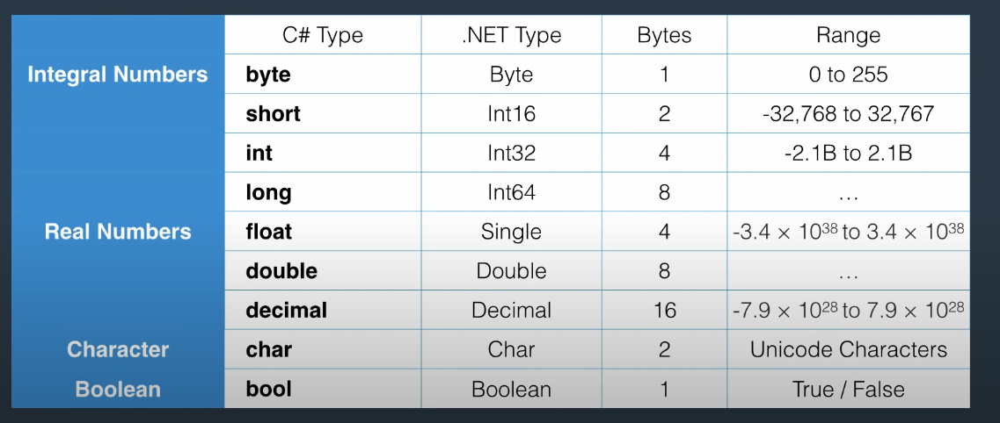

### Lecture on Most Commonly Used Primitive Types in C



#### What are Primitive Types?

Primitive types are the most basic data types available within the C# language. They are predefined by the language and are named by reserved keywords. Primitive types in C# are value types, meaning they store data directly within their own memory allocation.

#### Most Commonly Used Primitive Types in C

Here are the primitive types you will use most often in C#, ranked from 1 to 5 stars based on their frequency of use:

1. **int (★★★★★)**

   - **Description:** Represents a 32-bit signed integer.
   - **Usage:** The most commonly used numeric type for whole numbers.
   - **Example:**

     ```csharp
     int age = 30;
     ```

2. **double (★★★★★)**

   - **Description:** Represents a double-precision floating-point number.
   - **Usage:** The most commonly used type for floating-point numbers due to its balance between range and precision.
   - **Example:**

     ```csharp
     double height = 5.9;
     ```

3. **bool (★★★★★)**

   - **Description:** Represents a Boolean value (`true` or `false`).
   - **Usage:** Widely used in control flow and conditional statements.
   - **Example:**

     ```csharp
     bool isActive = true;
     ```

4. **char (★★★★☆)**

   - **Description:** Represents a single 16-bit Unicode character.
   - **Usage:** Used for storing individual characters.
   - **Example:**

     ```csharp
     char grade = 'A';
     ```

5. **string (★★★★★)**

   - **Description:** Represents a sequence of characters.
   - **Usage:** Although technically not a primitive type, `string` is heavily used for handling text.
   - **Example:**

     ```csharp
     string name = "John Doe";
     ```

### Var keyword

The `var` keyword in C# is used to declare implicitly typed local variables. This means the type of the variable is determined by the compiler at compile-time based on the type of the expression assigned to it. Here are the key points about `var`:

1. **Implicit Typing**: The type of the variable is inferred by the compiler, making the code more concise and readable.

   ```csharp
   var number = 10;  // inferred as int
   var name = "John";  // inferred as string
   ```

2. **Local Variables**: `var` can only be used for local variables inside methods, for loop variables, and other similar contexts. It cannot be used for class fields or method return types.

3. **Type Safety**: Despite being implicitly typed, `var` maintains strong typing. Once the type is inferred, it cannot be changed.

   ```csharp
   var list = new List<string>();  // inferred as List<string>
   list.Add("Hello");
   // list.Add(123);  // Compile-time error, as list is of type List<string>
   ```

4. **Readability**: Using `var` can enhance readability, especially when the type is evident from the right-hand side of the assignment.

   ```csharp
   var customer = new Customer();  // instead of Customer customer = new Customer();
   ```

5. **Avoid Overuse**: Overusing `var` can make the code less readable, especially when the type is not obvious.

   ```csharp
   var result = PerformComplexOperation();  // What is the type of result?
   ```

In summary, `var` in C# is a convenient way to declare local variables with inferred types, enhancing code readability and maintainability when used appropriately.

### Overflowing

In this lecture, we will cover what overflow is, why it occurs, and how to handle it in your C# programs.

#### What is Overflow?

Overflow occurs when a calculation produces a value that is outside the range that can be represented by the given data type. In C#, each numeric type has a specific range. For example, the `int` type can store values between -2,147,483,648 and 2,147,483,647. If a calculation exceeds this range, an overflow happens.

#### Why Does Overflow Occur?

Overflow occurs because of the fixed size of data types in memory. Each numeric type in C# is allocated a specific number of bits. When a value exceeds the maximum value that can be stored in those bits, it wraps around to the minimum value, or vice versa.

#### Examples of Overflow

1. **Overflow with `int` type:**

   ```csharp
   int maxValue = int.MaxValue;
   int result = maxValue + 1;
   Console.WriteLine(result); // Output: -2147483648 (wraps around)
   ```

2. **Overflow with `byte` type:**

   ```csharp
   byte maxByte = byte.MaxValue;
   byte overflowedByte = (byte)(maxByte + 1);
   Console.WriteLine(overflowedByte); // Output: 0 (wraps around)
   ```

#### Handling Overflow in C

C# provides several ways to handle overflow:

1. **Checked Contexts:**
   Using the `checked` keyword, you can explicitly enable overflow checking for a block of code or a single expression. If an overflow occurs in a checked context, the runtime throws an `OverflowException`.

   ```csharp
   try
   {
       int maxValue = int.MaxValue;
       int result = checked(maxValue + 1);
       Console.WriteLine(result);
   }
   catch (OverflowException ex)
   {
       Console.WriteLine("Overflow occurred!");
   }
   ```

2. **Unchecked Contexts:**
   By default, arithmetic operations and conversions in C# are unchecked. You can use the `unchecked` keyword to disable overflow checking explicitly. This can be useful for performance-critical code where you are sure no overflow will occur.

   ```csharp
   int maxValue = int.MaxValue;
   int result = unchecked(maxValue + 1);
   Console.WriteLine(result); // Output: -2147483648
   ```

3. **Using `checked` and `unchecked` Blocks:**
   You can also use blocks to apply overflow checking to multiple statements.

   ```csharp
   // Checked block
   try
   {
       checked
       {
           int maxValue = int.MaxValue;
           int result = maxValue + 1;
           Console.WriteLine(result);
       }
   }
   catch (OverflowException ex)
   {
       Console.WriteLine("Overflow occurred!");
   }

   // Unchecked block
   unchecked
   {
       int maxValue = int.MaxValue;
       int result = maxValue + 1;
       Console.WriteLine(result); // Output: -2147483648
   }
   ```

#### Why Handle Overflow?

Handling overflow is important because it can lead to unexpected behavior and bugs in your programs. Especially in financial, scientific, and other critical applications, ensuring the correctness of numerical computations is crucial.

#### Conclusion

Understanding and managing overflow is an essential part of writing robust C# programs. By using the `checked` and `unchecked` keywords, you can control how your program handles overflow situations, ensuring that your code behaves as expected even when numerical limits are exceeded.
