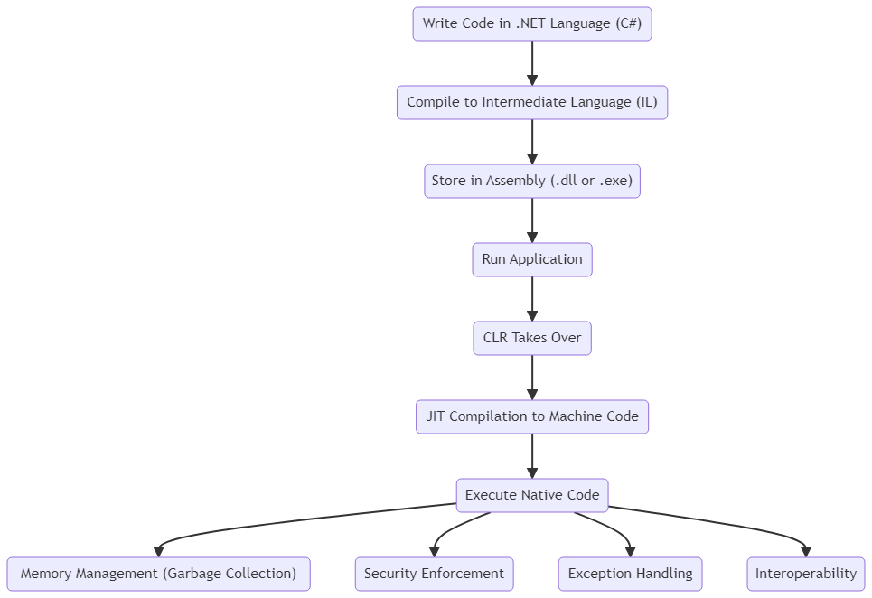
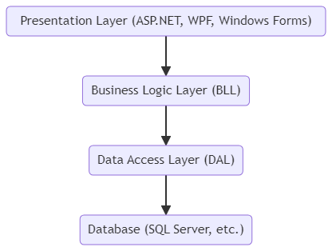

## Introduction

### C# vs. .NET

**C#:** - The programming language

- C# (pronounced "C-sharp") is a modern, object-oriented programming language developed by Microsoft. It is designed for building a wide range of applications that run on the .NET Framework.
- It is syntactically similar to other C-style languages like C++, Java, and JavaScript, making it easier for developers familiar with those languages to learn C#.
- Key features of C# include strong typing, imperative, declarative, functional, generic, and component-oriented programming disciplines.

**.NET:** - Framework for building apps on Windows

- .NET is a software development platform developed by Microsoft. It provides a controlled environment where software can be developed, installed, and executed on Windows-based operating systems.
- It includes a large class library known as the Framework Class Library (FCL) and provides language interoperability across several programming languages.
- .NET supports multiple languages, such as C#, VB.NET, F#, and more, allowing developers to choose the language that best suits their needs.

In summary, C# is a programming language, while .NET is the framework that provides the runtime and libraries necessary for C# applications to run.

### CLR (Common Language Runtime)



The Common Language Runtime (CLR) is the heart of the .NET Framework. It provides the execution environment for .NET programs. Here are some key aspects of CLR:

- **Code Execution:** CLR handles the execution of .NET programs, converting the compiled code (Intermediate Language or IL) into native machine code using a Just-In-Time (JIT) compiler.
- **Memory Management:** CLR manages the allocation and deallocation of memory for .NET applications, including garbage collection to clean up unused objects.
- **Exception Handling:** CLR provides a consistent model for handling exceptions across different .NET languages.
- **Security:** CLR enforces security policies, ensuring that code runs with the appropriate permissions and protecting against various security threats.
- **Interoperability:** CLR enables .NET applications to interact with existing code written in other languages, such as COM components or native Win32 APIs.

### Architecture of .NET Applications



.NET applications typically follow a layered architecture that separates concerns and improves maintainability. Here’s a high-level overview of the architecture of .NET applications:

1. **Presentation Layer (UI Layer):**

   - This is the topmost layer, responsible for displaying the user interface and handling user interactions. It can be a web application (ASP.NET), a desktop application (WPF or Windows Forms), or a mobile application (Xamarin).

2. **Business Logic Layer (BLL):**

   - This layer contains the core business logic of the application. It processes user inputs, makes decisions, performs calculations, and enforces business rules.

3. **Data Access Layer (DAL):**

   - This layer handles data persistence and retrieval. It interacts with the database or other data storage mechanisms, such as Entity Framework or ADO.NET.

4. **Database:**
   - This is where the actual data is stored. It can be a relational database (e.g., SQL Server, MySQL) or a NoSQL database (e.g., MongoDB).

### Example Code in C

Here’s a simple C# example demonstrating a basic .NET application structure:

```csharp
// Presentation Layer (Console Application)
using System;

namespace MyApp
{
    class Program
    {
        static void Main(string[] args)
        {
            var businessLogic = new BusinessLogic();
            string result = businessLogic.ProcessData("Hello, World!");
            Console.WriteLine(result);
        }
    }

    // Business Logic Layer
    public class BusinessLogic
    {
        public string ProcessData(string input)
        {
            var dataAccess = new DataAccess();
            return dataAccess.SaveData(input);
        }
    }

    // Data Access Layer
    public class DataAccess
    {
        public string SaveData(string data)
        {
            // Simulate data saving
            return $"Data '{data}' has been saved.";
        }
    }
}
```

In this example, the `Program` class represents the Presentation Layer, the `BusinessLogic` class represents the Business Logic Layer, and the `DataAccess` class represents the Data Access Layer.

### Comparison with C and C++

| **Language** | **Origin**                                                                             | **Design Goals**                                                                                                                           | **Key Features**                                                                                                                                               |
| ------------ | -------------------------------------------------------------------------------------- | ------------------------------------------------------------------------------------------------------------------------------------------ | -------------------------------------------------------------------------------------------------------------------------------------------------------------- |
| **C**        | Developed in the early 1970s by Dennis Ritchie at Bell Labs.                           | System programming, low-level access to memory and hardware, and writing operating systems (Unix).                                         | Low-level access through pointers, procedural programming, portability.                                                                                        |
| **C++**      | Developed in the early 1980s by Bjarne Stroustrup, originally called "C with Classes." | Add object-oriented features to C while maintaining performance and efficiency.                                                            | Object-oriented programming, support for classes and inheritance, backward compatibility with C, and templates for generic programming.                        |
| **C#**       | Developed in the early 2000s by Microsoft as part of its .NET initiative.              | Simplify Windows application development, modernize programming practices, and improve productivity with a focus on safety and simplicity. | Managed code with garbage collection, strong type safety, component-oriented programming, extensive standard library, and integration with the .NET Framework. |
