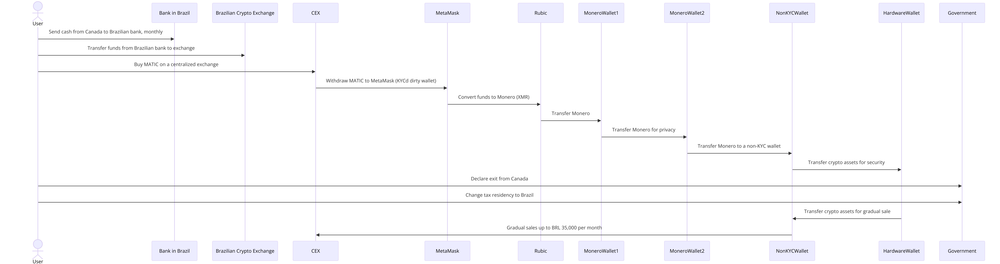

### Strategies to Avoid Tax Legally

### 1) Canada: Make Use of RRSP and TFSA

- **Fill all of your RRSP and TFSA with BTC ETFs:**
  - Contribute the maximum allowable amounts to your RRSP (Registered Retirement Savings Plan) and TFSA (Tax-Free Savings Account) with investments in Bitcoin ETFs.
  - **RRSP Benefits:** Contributions are tax-deductible, reducing your taxable income, and the investments grow tax-deferred until withdrawal.
  - **TFSA Benefits:** Investments grow tax-free, and withdrawals are also tax-free.
  - **Avoiding Deemed Disposition:** When you lose tax residency in Canada, assets in RRSP and TFSA are not subject to deemed disposition rules, which trigger capital gains tax.

### 2) Stealth Fortress Strategy

- Basically this strategy involves buying MATIC in a CEX, using a bridge like Rubic to convert it to Monero, do multiple swap to erase traces, and use Rubic again to get the desired tokens, but now stored in NON-KYCD wallets.

#### Fiat x Crypto

#### Option A (BEST)

1. **Use Bisq**
   - Buy BTC with Fiat through bis

##### Option B

1. **Transfer Funds from Canada to Brazil, Monthly:**

   - **Action:** Move funds transparently from Canadian to Brazilian bank accounts.
   - **Benefit:** Ensures clear and documented transfer out of Canadian jurisdiction.

2. **Transfer Funds from Brazilian Bank to ByBit:**

   - **Action:** Send funds from Brazilian bank to ByBit for purchasing crypto assets.
   - **Benefit:** Maintains transparency and legal compliance.

3. **On a Centralized Exchange, Buy MATIC:**

   - **Action:** Buy MATIC on a CEX and withdraw to a KYC'd wallet (MetaMask).
   - **Benefit:** Directly links the purchase to a known and transparent exchange.

#### Option C

1. **Buy XMR Using Kraken**

- Not ideal, because it will leave logs.

#### Next Steps

4. **Convert Funds to Monero via Rubic USING MULLVAD VPN:**

   - **Action:** Convert MATIC to Monero using Rubic.
   - **Benefit:** Provides privacy through Monero.
   - **VPN:** Use Mullvad VPN for enhanced privacy. They don't keep logs either.

5. **Transfer Monero to Multiple Wallets:**

   - **Action:** Transfer Monero between MONERO wallets for enhanced privacy. (eg. Monero A => Monero B)
   - **Benefit:** Reduces traceability.

6. **Transfer to Non-KYC Wallet:**

   - **Action:** Move Monero from the final wallet to a non-KYC wallet.
   - **Benefit:** Maintains anonymity.

7. **Store in Hardware Wallet:**

   - **Action:** Store crypto assets securely in a hardware wallet.
   - **Benefit:** Ensures security against hacks and theft.

8. **Change Tax Residency:**

   - **Action:** Declare exit from Canada and establish tax residency in Brazil.
   - **Benefit:** Shifts tax obligations to Brazil.

9. **Gradual Sale from Hardware Wallet:**
   - **Action:** Gradually transfer crypto assets for sale, respecting BRL 35,000 per month exemption.
   - **Benefit:** Minimizes tax liabilities in Brazil.

### Enhanced Risk Management

1. **Engage Tax Professionals:**

   - **Canada:** Ensure all transfers and declarations comply with Canadian tax laws.
   - **Brazil:** Optimize sales and compliance with Brazilian tax laws.

2. **Detailed Documentation:**

   - **Log All Transactions:** Keep detailed records of every step, including Monero conversions and transfers.

3. **Backup and Recovery:**

   - **Secure Backups:** Implement a robust backup plan for wallet seeds and keys.

4. **Simplified Process:**
   - **Streamline Steps:** Reduce the number of intermediary steps to make the process more manageable.

### Summary

**Legal Compliance:**

- Full engagement with tax professionals in both Canada and Brazil to ensure all transactions are compliant.

**Privacy and Security:**

- Detailed documentation and enhanced security measures for all wallets and transactions.

**Tax Efficiency:**

- Optimized tax planning with Brazilian tax advisors to ensure minimal liabilities.

**Ease of Execution:**

- Simplified process with fewer steps while maintaining privacy and security.

**Risk Management:**

- Comprehensive backup and recovery plans and thorough documentation.
