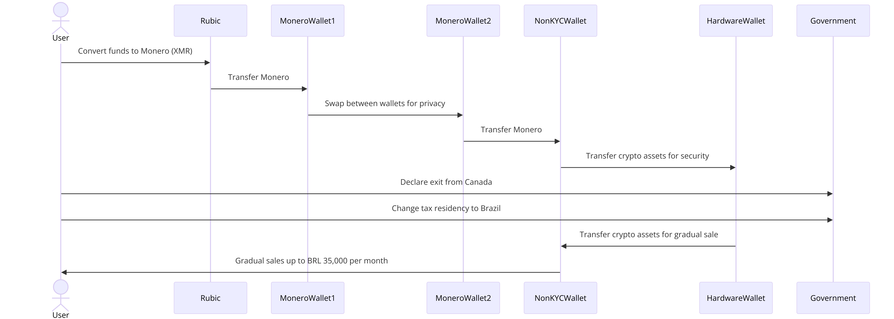

### Strategies to Avoid Tax Legally

### 1) Canada: Make Use of RRSP and TFSA

- **Fill all of your RRSP and TFSA with BTC ETFs:**
  - Contribute the maximum allowable amounts to your RRSP (Registered Retirement Savings Plan) and TFSA (Tax-Free Savings Account) with investments in Bitcoin ETFs.
  - **RRSP Benefits:** Contributions are tax-deductible, reducing your taxable income, and the investments grow tax-deferred until withdrawal.
  - **TFSA Benefits:** Investments grow tax-free, and withdrawals are also tax-free.
  - **Avoiding Deemed Disposition:** When you lose tax residency in Canada, assets in RRSP and TFSA are not subject to deemed disposition rules, which trigger capital gains tax.

### 2) Cashing Out Non-KYCd Wallets

1. **Convert Funds to Monero via Rubic:**

   - Use Rubic to convert your funds to Monero (XMR), a cryptocurrency known for its privacy features.

2. **Transfer Monero to Multiple Wallets:**

   - Transfer Monero from MoneroWallet1 to MoneroWallet2 to enhance privacy and minimize traceability.

3. **Transfer to Non-KYC Wallet:**

   - Transfer Monero from MoneroWallet2 to a non-KYC wallet to maintain anonymity.

4. **Store in Hardware Wallet:**

   - Transfer the crypto assets from the non-KYC wallet to a hardware wallet for added security.

5. **Change Tax Residency:**

   - Declare your exit from Canada and officially change your tax residency to Brazil.

6. **Gradual Sale from Hardware Wallet:**
   - Gradually transfer crypto assets from the hardware wallet to the non-KYC wallet for sale, ensuring each transaction respects the BRL 35,000 per month exemption to avoid triggering tax events.

### Ranking and Evaluation

#### Security and Privacy

**⭐⭐⭐⭐⭐ (5 Stars)**

- **Pros:**
  - **High Privacy:** Using Monero and multiple wallets significantly enhances privacy.
  - **Non-KYC Wallets:** Avoiding KYC ensures greater anonymity.
- **Cons:**
  - **Complexity:** Managing multiple wallets and swaps increases complexity.

#### Conformity with Regulations

**⭐⭐⭐⭐ (4 Stars)**

- **Pros:**
  - **Initial Compliance:** Converting funds to Monero while still in Canada ensures compliance with initial regulations.
  - **Gradual Sale:** Respecting the BRL 35,000 exemption ensures compliance with Brazilian tax laws.
- **Cons:**
  - **Scrutiny:** There may be scrutiny regarding the source of funds when converting to fiat in Brazil.
  - **Documentation:** Requires meticulous record-keeping to justify the source of funds if questioned.

#### Ease of Execution

**⭐⭐⭐ (3 Stars)**

- **Pros:**
  - **Direct Conversion:** Using Rubic for direct conversion to Monero simplifies the process.
- **Cons:**
  - **Technical Complexity:** Requires familiarity with multiple wallets and Monero.
  - **Management:** More steps and wallet management compared to simpler strategies.

#### Flexibility and Liquidity

**⭐⭐⭐⭐ (4 Stars)**

- **Pros:**
  - **Liquidity:** Using Monero ensures liquidity and ease of transfer.
  - **Flexibility:** Allows gradual sales to manage tax impact and cash flow.
- **Cons:**
  - **Conversion Time:** Swaps and multiple transfers may introduce delays.

#### Risks and Considerations

**⭐⭐⭐⭐ (4 Stars)**

- **Pros:**
  - **Minimized Traceability:** Using Monero and multiple wallets minimizes traceability.
  - **Security:** Storing in a hardware wallet adds a layer of security.
- **Cons:**
  - **Market Volatility:** Fluctuations in Monero's value during swaps and transfers.
  - **Legal Scrutiny:** Potential for legal scrutiny when converting to fiat.

### Summary

- **Security and Privacy:** ⭐⭐⭐⭐⭐
- **Conformity with Regulations:** ⭐⭐⭐⭐
- **Ease of Execution:** ⭐⭐⭐
- **Flexibility and Liquidity:** ⭐⭐⭐⭐
- **Risks and Considerations:** ⭐⭐⭐⭐

### Overall Rating

**⭐⭐⭐⭐ (4 Stars)**

### Conclusion

This strategy is highly effective in terms of privacy and security, making it an excellent choice for maintaining anonymity. The use of Monero and multiple wallets minimizes traceability, and storing assets in a hardware wallet adds an extra layer of security. However, the complexity of execution and potential scrutiny when converting funds to fiat in Brazil are important considerations. Proper documentation and legal consultation are recommended to ensure compliance and mitigate risks.
